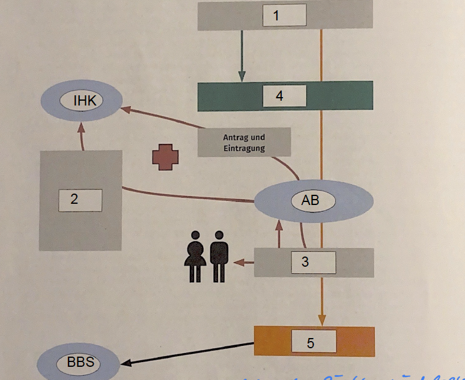

# [AB](01_Lernsituation%201%20-%20Die%20duale%20Ausbildung.pdf)
## Seite 12
## A1

## A4
| *nr* | ✔⛌ | Begründung |
| --- | --- | --- |
|  1 | ✔ |  |
|  2 | ⛌ |  |
|  3 | ⛌ | Nur mit Begründung |
|  4 | ⛌ | Der Betrieb ist nicht Verpflichtet |
|  5 | ✔ |  |
|  6 | ✔⛌ |  |
|  7 | ✔⛌ |  |
|  8 | ✔⛌ |  |
|  9 | ✔⛌ |  |
| 10 | ✔⛌ |  |
| 11 | ✔⛌ |  |
| 12 | ✔⛌ |  |
| 13 | ✔⛌ |  |
| 14 | ✔⛌ |  |
| 15 | ✔⛌ |  |
| 16 | ✔⛌ |  |
| 17 | ✔⛌ |  |
| 18 | ✔⛌ |  |
| 19 | ✔⛌ |  |
| 20 | ✔⛌ |  |
| 21 | ✔⛌ |  |
| 22 | ✔⛌ |  |
| 23 | ✔⛌ |  |

